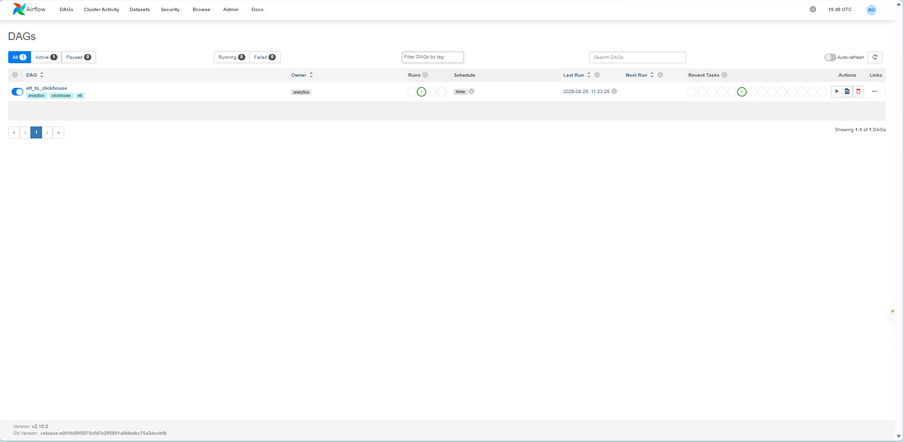
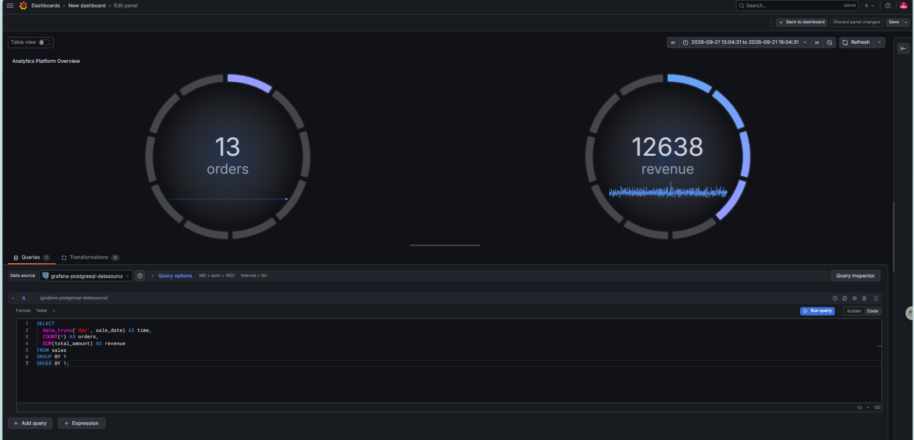
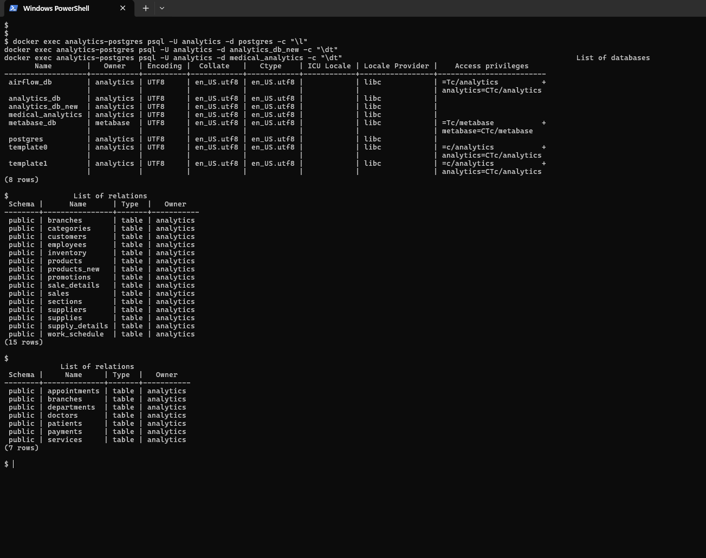
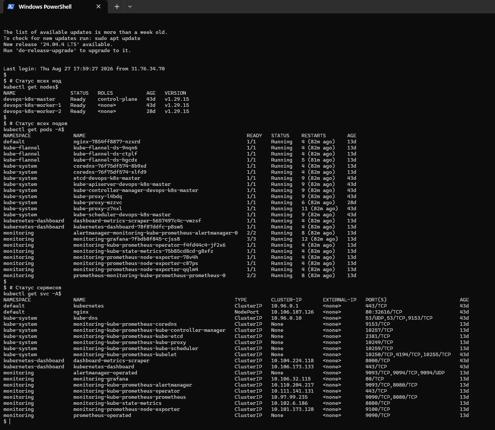
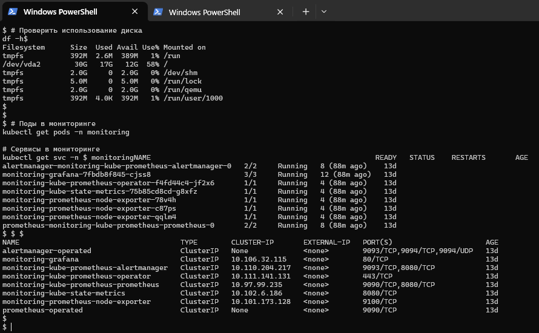
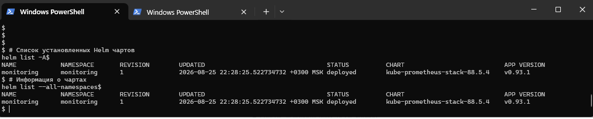

# ☁️ Cloud Infrastructure Project — BI-стек + Kubernetes-кластер

> ⚠️ **Статус:** инфраструктура (4 ВМ на Cloud.ru Evolution) была развёрнута для этого проекта
> и демонтирована после документирования (актуально на 28.09.2026). Код, схемы БД,
> конфигурация, dbt-модели, манифесты и скриншоты сохранены в этом репозитории.

> Два инфраструктурных мини-проекта на 4 облачных ВМ: аналитическая платформа на Docker Compose
> и Kubernetes-кластер с мониторингом. Развёрнуты, эксплуатировались и задокументированы
> в рамках практики Data/Analytics Engineering и Platform-инженерии.

[](https://www.docker.com/)
[](https://kubernetes.io/)
[](https://www.postgresql.org/)
[](https://clickhouse.com/)
[](https://airflow.apache.org/)
[](https://www.getdbt.com/)
[](https://prometheus.io/)
[](https://grafana.com/)

---

## ⚠️ О проекте (честно)

Учебный/демонстрационный проект на облачных ВМ (Cloud.ru Evolution), развёрнутый для практики
инфраструктурных навыков. Данные в BI-части — **синтетические** (розничная сеть-демо).
Кластер Kubernetes — реальный работающий control plane + 2 worker-ноды с настоящим мониторингом,
но без production-нагрузки (тестовый деплой nginx).

**Зачем два раздела:** это разные компетенции. BI-стек показывает Data/Analytics Engineering
(ETL, DWH, оркестрация, BI). Kubernetes-кластер показывает Platform/DevOps-навыки
(provisioning, control plane, мониторинг стека через Helm).

---

## 🗺️ Карта проекта

| Часть | ВМ | Роль | Подробнее |
|---|---|---|---|
| **BI/Analytics Stack** | devops-main (213.171.26.123) | Docker Compose: PostgreSQL → dbt → ClickHouse → Metabase/Grafana, оркестрация в Airflow | [bi-analytics-stack/README.md](./bi-analytics-stack/README.md) |
| **Kubernetes Cluster** | k8s-master (control plane) + k8s-worker-1 + k8s-worker-2 | Kubernetes v1.29, Flannel CNI, мониторинг kube-prometheus-stack (Helm) | [k8s-monitoring-cluster/README.md](./k8s-monitoring-cluster/README.md) |

---

## 📦 Кейс 1 — [BI/Analytics Stack](./bi-analytics-stack/)

BI-стек из 16 сервисов Docker Compose:
PostgreSQL, ClickHouse, Metabase, Superset, Airflow (webserver и scheduler), dbt, Grafana,
Redis, MinIO, Kafka, Qdrant, MongoDB, NiFi, Node-RED, Redash.

**Стек:** Docker Compose · PostgreSQL 15 · ClickHouse · Airflow 2.10 · dbt · Grafana · Metabase

**Что сделано:**
- 8 баз PostgreSQL, 15+7 таблиц, 10 000 записей в `sales`
- ETL Airflow DAG `etl_to_clickhouse` (4 задачи, успешно отработал)
- dbt: staging + mart модели, lineage-граф
- ClickHouse `sales_daily`: 30 000 строк
- Grafana дашборд: заказы, выручка, средний чек
- MinIO bucket для бэкапов
- 5000 записей синтетических медицинских данных

---

## 📦 Кейс 2 — [Kubernetes Monitoring Cluster](./k8s-monitoring-cluster/)

Кластер K8s (1 master + 2 worker) с Prometheus + Grafana через Helm.

**Стек:** Kubernetes 1.29 · Flannel CNI · Helm 3 · Prometheus · Grafana · containerd

**Что сделано:**
- Кластер собран с нуля (`kubeadm init`, `kubeadm join`)
- Flannel CNI переустановлен после сбоя
- Prometheus + Grafana развёрнуты через Helm
- 3 ноды находились в состоянии Ready

---

## 🏗️ Общая архитектура

```
┌────────────────────────────┐        ┌──────────────────────────────────┐
│   BI / ANALYTICS STACK     │        │      KUBERNETES CLUSTER           │
│   (devops-main, Docker)    │        │   (k8s-master + 2 worker'а)       │
│                            │        │                                   │
│  PostgreSQL → dbt →        │        │  control-plane ─┬─ worker-1       │
│  ClickHouse → Metabase/    │        │                 └─ worker-2       │
│  Grafana, Airflow-оркестр. │        │  Flannel (CNI)                    │
│                            │        │  kube-prometheus-stack (Helm):    │
│                            │        │   Prometheus + Grafana +          │
│                            │        │   Alertmanager + node-exporter    │
└────────────────────────────┘        └──────────────────────────────────┘
```

---

## 🖼️ Скриншоты

### BI-стек




### Kubernetes




---

## 📂 Структура репозитория

```
cloud-infrastructure-project/
├── README.md                                # ← вы здесь (главный хаб)
├── .gitignore                               # исключения (secrets, dumps, logs)
│
├── bi-analytics-stack/                      # Кейс 1: BI + DWH
│   ├── README.md                            # описание BI-кейса
│   ├── backups/                             # схемы БД + sample данные
│   ├── configs/                             # docker-compose.yml + .env.example
│   ├── dbt/                                 # dbt-модели (staging)
│   ├── airflow/dags/                        # DAG etl_to_clickhouse.py
│   ├── database/                            # SQL-схемы (7 файлов) + backups
│   └── scripts/                             # 12 SQL-загрузчиков
│
├── k8s-monitoring-cluster/                  # Кейс 2: K8s + мониторинг
│   ├── README.md                            # описание K8s-кейса
│   ├── K8s-master/                          # index-манифесты (airflow, minio)
│   ├── configs/                             # скрипты (collect, get-docker, get-helm)
│   ├── manifests/                           # kubectl get -o yaml (nodes, namespaces, svc, storage, helm)
│   ├── values/                              # Helm values (monitoring)
│   ├── worker-1/                            # kubelet.log, containerd.log, system_info
│   └── worker-2/                            # kubelet.log, system_info
│
├── docs/                                    # Расширенная документация
│   ├── architecture-bi.md                   # DWH-архитектура BI (схемы, слои, потоки)
│   ├── bi-analytics-stack-flagship.md       # флагманское описание BI-кейса
│   ├── bi-devops-main-tech.md               # техничка ВМ devops-main (порты, сервисы)
│   ├── cloudru-chronology.md                # ⭐ полная хронология проекта + качество данных
│   ├── k8s-master-tech.md                   # техничка k8s-master
│   ├── k8s-cluster-setup.md                 # пошаговая установка K8s-кластера
│   ├── k8s-commands.md                      # шпаргалка команд K8s
│   ├── retail-data-generation.md            # генератор retail-датасета (справочный)
│   ├── git-guide.md                         # работа с Git в проекте
│   └── winscp-guide.md                      # работа с WinSCP (SFTP)
│
└── screenshots/                             # 9 подпапок, ~40 скринов
    ├── 01_infrastructure/                   # Docker, диск, Cloud.ru UI, биллинг
    ├── 02_postgresql/                       # базы, таблицы, sales
    ├── 03_clickhouse/                       # схема, данные
    ├── 04_redis/                            # keys, values
    ├── 05_minio/                            # buckets
    ├── 06_grafana/                          # дашборды
    ├── 07_node_red/                         # flow (+ html-экспорт)
    ├── 08_airflow/                          # DAG list, run, graph (+ html-экспорт)
    └── 09_kubernetes/                       # nodes, pods, helm, ssh
```

### 📚 Описание документации

| Файл | Назначение |
|---|---|
| `README.md` (этот) | Главный хаб проекта, карта кейсов, структура |
| `bi-analytics-stack/README.md` | Краткое описание BI-кейса: запуск, компоненты |
| `k8s-monitoring-cluster/README.md` | Краткое описание K8s-кейса: развёртывание, мониторинг |
| `docs/architecture-bi.md` | Глубокое описание DWH-архитектуры BI: слои, таблицы, потоки |
| `docs/bi-analytics-stack-flagship.md` | Флагманское описание BI-кейса для рекрутера |
| `docs/bi-devops-main-tech.md` | Технические детали ВМ devops-main: сервисы и порты |
| `docs/cloudru-chronology.md` | **Полная хронология проекта**: даты, инфраструктура, инциденты, качество данных, cheatsheet |
| `docs/k8s-master-tech.md` | Технические детали k8s-master (control plane, конфиги) |
| `docs/k8s-cluster-setup.md` | Пошаговая инструкция установки K8s-кластера |
| `docs/k8s-commands.md` | Шпаргалка команд `kubectl`, `kubeadm`, диагностика |
| `docs/retail-data-generation.md` | Генератор retail-датасета (справочный материал, требует адаптации) |
| `docs/git-guide.md` | Правила работы с Git в этом проекте |
| `docs/winscp-guide.md` | Настройка и правила работы с WinSCP (SFTP) |

---

## 🎯 Компетенции и практический опыт

- **Data/Analytics Engineering:** PostgreSQL, ETL/ELT в Airflow, dbt (staging → mart), ClickHouse, BI-дашборды в Grafana, Metabase и Superset
- **Платформенная инфраструктура:** Docker Compose, Kubernetes (`kubeadm`, Flannel CNI), Helm, Prometheus и Grafana
- **Эксплуатация:** Linux (Ubuntu 22.04), SSH, Bash; диагностика нехватки диска и восстановление PostgreSQL
- **Работа в ограничениях:** эксплуатация сервисов на ВМ с SSD 30 ГБ и устранение инфраструктурных сбоев

---

## 🔒 Безопасность

Пароли и секреты **не коммитятся** в репозиторий.
Все значения вынесены в `.env.example` с плейсхолдерами.
Реальные `.env`, `kubeconfig`, `secrets.yaml` — в приватной папке вне git.

В черновиках документации фигурировали реальные значения — перед публикацией заменены:

| Что было | Заменено на |
|---|---|
| Grafana admin-пароль | `${GRAFANA_ADMIN_PASSWORD}` |
| ClickHouse пароль | `${CLICKHOUSE_PASSWORD}` |
| Airflow `admin/admin` | `${AIRFLOW_ADMIN_PASSWORD}` |
| Base64 Grafana-пароль | `<base64>` → placeholder |

`.env`, `kubeconfig`, `*.pem`, `id_ed25519`, `cloud-private/` — в `.gitignore`.

---

## 📅 Даты проекта

- **Развёртывание:** июль 2026
- **Эксплуатация:** июль — сентябрь 2026
- **Демонтаж:** сентябрь 2026

---

## 📬 Автор

**Артур Минин** — Data Analyst / Analytics Engineer
GitHub: https://github.com/MartinMinart
